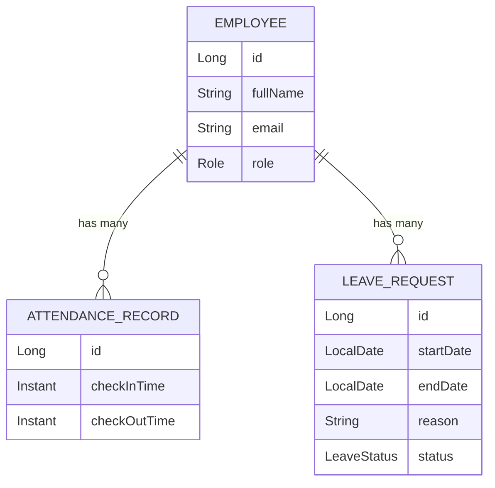

# Attendance System

[](https://github.com/MerlynCode/attendance-system/actions/workflows/ci.yml)

A small employee attendance management backend for a single department: check-in/check-out
tracking, leave requests with approval workflow, and an admin monthly attendance summary.
Built with Kotlin, Spring Boot, and Spring Data JPA as a portfolio project demonstrating a
conventional layered REST API.

## Tech stack

- Kotlin + Spring Boot 4 (Web, Data JPA, Security, Validation)
- PostgreSQL for docker-compose/CI, H2 (in-memory) for fast local dev and tests
- springdoc-openapi for the OpenAPI spec / Swagger UI
- JUnit 5, MockK (unit tests), Spring Boot Test + MockMvc (integration tests)
- ktlint for formatting/linting

## Architecture

Standard layered structure, with DTOs kept separate from JPA entities so the API contract
doesn't leak persistence details:

```
controller  ->  service  ->  repository  ->  entity
    |              |
   dto          exception (domain rules enforced here, mapped to HTTP status by
                            a @RestControllerAdvice)
```

- **controller** - HTTP concerns only: routing, request/response DTOs, pulling the
  authenticated employee off the `Authentication` principal. No business logic.
- **service** - business rules: check-in/check-out state transitions, leave request overlap
  validation, monthly aggregation. Transactional boundaries live here.
- **repository** - Spring Data JPA interfaces, one per aggregate root.
- **dto** - `request`/`response` records, mapped to/from entities via small `from(...)`
  factory functions on the response DTOs.

## Entity relationships



Each `AttendanceRecord` represents one check-in/check-out pair; an employee can only have one
open (not-yet-checked-out) record at a time. Each `LeaveRequest` starts as `PENDING` and an
admin transitions it to `APPROVED` or `REJECTED`; a new request is rejected at submission time
if its date range overlaps another `PENDING` or `APPROVED` request from the same employee.

Schema is created/updated via Hibernate's `ddl-auto: update` rather than versioned migrations
(e.g. Flyway) - a reasonable simplification at this scale, called out here rather than left
implicit.

## API

All endpoints are under `/api`. Interactive docs: `/swagger-ui.html` (public). Raw spec:
`/v3/api-docs`.

| Method | Path | Access | Description |
|---|---|---|---|
| POST | `/api/attendance/check-in` | Employee | Check the caller in (fails if already checked in) |
| POST | `/api/attendance/check-out` | Employee | Check the caller out (fails if not checked in) |
| POST | `/api/leave-requests` | Employee | Submit a leave request (fails on overlap or invalid range) |
| GET | `/api/admin/leave-requests?status=` | Admin | List leave requests, optionally filtered by status |
| PATCH | `/api/admin/leave-requests/{id}/approve` | Admin | Approve a leave request |
| PATCH | `/api/admin/leave-requests/{id}/reject` | Admin | Reject a leave request |
| GET | `/api/admin/attendance/summary/{employeeId}?year=&month=` | Admin | Monthly attendance summary for one employee |

## Auth

HTTP Basic against an in-memory `Spring Security` user store (`InMemoryUserDetailsManager`),
seeded on startup to mirror three `Employee` rows by email (see `DataSeeder`/`SecurityConfig`):

| Email | Password | Role |
|---|---|---|
| `admin@company.com` | `admin123` | ADMIN |
| `employee1@company.com` | `employee123` | EMPLOYEE |
| `employee2@company.com` | `employee123` | EMPLOYEE |

Employees can only act on their own record - it's derived from the authenticated principal,
never from a client-supplied id. This is a deliberately lightweight choice over a full
JWT/OAuth2 flow, appropriate for a single-department demo (see "Things to Add" below).

**Caveat:** HTTP Basic sends credentials on every request; it's fine over plain HTTP for local
demo/grading purposes here, but it must never be used without TLS in a real deployment, since
credentials would otherwise be sent in the clear.

## Running locally

**Option A - H2, no Docker:**

```bash
./gradlew bootRun --args='--spring.profiles.active=h2'
```

**Option B - Postgres via docker-compose:**

```bash
docker compose up -d postgres
./gradlew bootRun
```

The app defaults to Postgres (`localhost:5432/attendance`, user/password `attendance`); the
`h2` Spring profile switches to an in-memory H2 database instead. Opening this repo in a
Codespace/devcontainer (`.devcontainer/devcontainer.json`) already gives you JDK 21, the
Gradle wrapper, and a linked Postgres container.

## Tests

```bash
./gradlew test
```

Tests run against H2 by default (`src/test/resources/application.yml` activates the `h2`
profile), so no Docker/Postgres is needed locally. CI additionally runs the same suite against
a real Postgres service container, so both the fast local path and the production-like path
are exercised.

## Things to Add

Intentionally out of scope for this portfolio-scale project:

- **Multi-department / multi-tenant support** - everything here assumes a single company/department.
- **Payroll calculation integration** - attendance and leave data isn't wired to any payroll system.
- **Notifications** - no email/Slack alerts for pending approvals or leave decisions.
